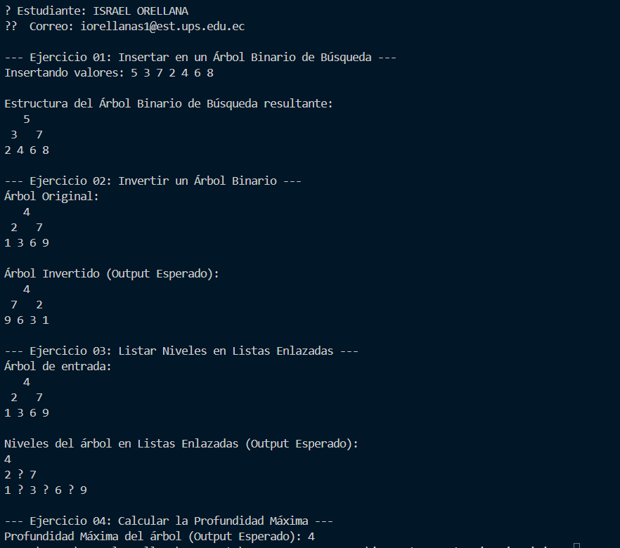

# PL - ARboles

## 📌 PL - ARboles

- **Título:** PL - ARboles
- **Asignatura:** Estructura de Datos  
- **Carrera:** Computación  
- **Estudiantes:** Israel Orellana 
- **Fecha:** 6 de julio del 2025  
- **Profesor:** Ing. Pablo Torres  

---
# 🌳 Proyecto: Operaciones Básicas en Árboles Binarios con Java

Este proyecto implementa varias operaciones fundamentales sobre árboles binarios utilizando Java. Está organizado en distintos ejercicios que incluyen:

- Inserción de nodos.
- Impresión visual del árbol.
- Inversión del árbol (imagen espejo).
- Listado de nodos por niveles.
- Cálculo de la profundidad máxima.

---

## 📂 Estructura del Proyecto

src/
└── main/
├── Ejercicio_01_insert/
│ └── Ejercicio_01_insert.java # Inserta nodos e imprime el árbol
├── Ejercicio_02_invert/
│ └── Ejercicio_02_invert.java # Invierte el árbol
├── Ejercicio_03_listLeves/
│ └── Ejercicio_03_listLeves.java # Lista nodos por niveles
└── Ejercicio_04_depth/
└── Ejercicio_04_depth.java # Calcula la profundidad del árbol

---

## ✅ Funcionalidades por Ejercicio

### 🟩 Ejercicio 01: Inserción e Impresión del Árbol

- Inserta valores en un **árbol binario de búsqueda (BST)**.
- Recorre el árbol en **orden (in-order)** y retorna una lista de valores.
- Imprime el árbol visualmente nivel por nivel, con espaciado proporcional a la altura.

### 🟨 Ejercicio 02: Inversión del Árbol

- Invierte el árbol binario de forma recursiva (imagen espejo).
- Intercambia los hijos izquierdo y derecho de todos los nodos.

### 🟦 Ejercicio 03: Listado por Niveles

- Genera una lista de listas enlazadas (`LinkedList`), cada una representando los valores de un **nivel del árbol**.
- Se implementa mediante un recorrido **Breadth-First Search (BFS)** con cola.

### 🟥 Ejercicio 04: Profundidad del Árbol

- Calcula la **profundidad máxima** de un árbol binario.
- Utiliza recursividad para evaluar la profundidad de los subárboles izquierdo y derecho.

---
## SALIDA DE CONSOLA:


## 🧪 Ejemplo de Uso (Pseudocódigo)

```java
Ejercicio_01_insert inserter = new Ejercicio_01_insert();
Node root = null;
root = inserter.insert(root, 10);
root = inserter.insert(root, 5);
root = inserter.insert(root, 15);
inserter.printTree(root); // imprime el árbol visualmente

Ejercicio_02_invert inverter = new Ejercicio_02_invert();
inverter.invertTree(root); // invierte el árbol

Ejercicio_03_listLeves lister = new Ejercicio_03_listLeves();
List<LinkedList<Integer>> niveles = lister.levelOrder(root);

Ejercicio_04_depth depthCalculator = new Ejercicio_04_depth();
int profundidad = depthCalculator.maxDepth(root);
System.out.println("Profundidad máxima: " + profundidad);

